# Auto LearnSocial

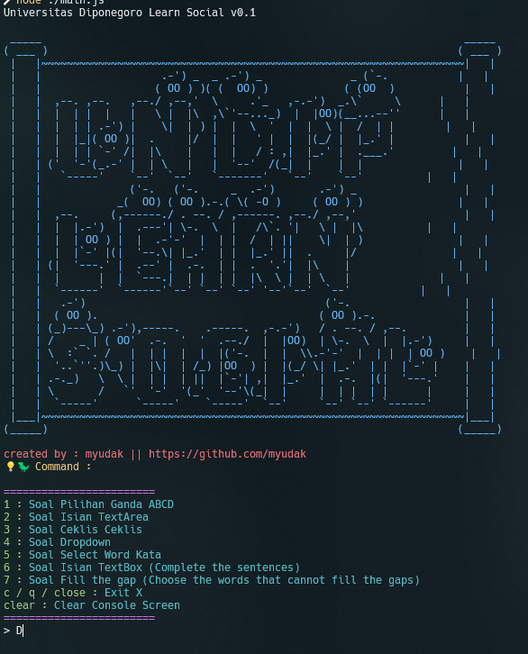
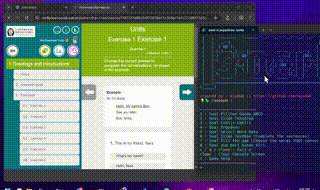
<video controls src="./assets/video_preview.mp4" title="Title"></video>

⭐ Star us on GitHub — it motivates us a lot!

[](https://x.com/intent/tweet?text=Check%20out%20this%20project%20on%20GitHub:%20https://github.com/Abblix/Oidc.Server%20%23OpenIDConnect%20%23Security%20%23Authentication)
[](https://www.facebook.com/sharer/sharer.php?u=https://github.com/Abblix/Oidc.Server)
[](https://www.linkedin.com/sharing/share-offsite/?url=https://github.com/Abblix/Oidc.Server)
[](https://www.reddit.com/submit?title=Check%20out%20this%20project%20on%20GitHub:%20https://github.com/Abblix/Oidc.Server)
[](https://t.me/share/url?url=https://github.com/Abblix/Oidc.Server&text=Check%20out%20this%20project%20on%20GitHub)

## 🚀 About

This isn’t exactly a ‘hack’ in the traditional sense—it's more like an incredibly efficient automation technique for responding to a wide range of question types on the LearnSocial platform. Using Puppeteer, this method automates the process of answering questions, handling everything from multiple-choice to short-answer formats. It’s designed to provide rapid, consistent responses, saving time and reducing effort while maintaining accuracy across various types of queries. Perfect for those looking to streamline their interactions with the platform, this solution leverages the power of Puppeteer’s scripting capabilities to automatically fetch, analyze, and respond to questions, making it a valuable tool for anyone aiming to navigate LearnSocial efficiently and effectively."ns.

**Disclaimer**: This program is intended solely for educational and informational purposes. It is not designed, intended, or recommended for any use that would violate the terms of service, policies, or rules of any other software, platform, or service. The author and contributors of this program bear no responsibility for any misuse, abuse, or damages resulting from the use of this software. Users are solely responsible for ensuring they use this program within the boundaries of legal, ethical, and policy requirements. By using this program, you acknowledge and agree to assume all risks and responsibilities associated with its use.

## Get started

### Prerequisites

- [git](https://git-scm.com)
- [pnpm](https://pnpm.io/installation)
- [node.js](https://nodejs.org/en/download/package-manager)

### 1. Clone the repository

```
git clone https://github.com/myudak/learnSocial-hack.git
```

```
cd learnSocial-hack
```

### 2. Install dependencies

```
pnpm install
```

### 3. Run the project

tambah file `.env` di root folder
dengan username dan password learnsocial

contoh

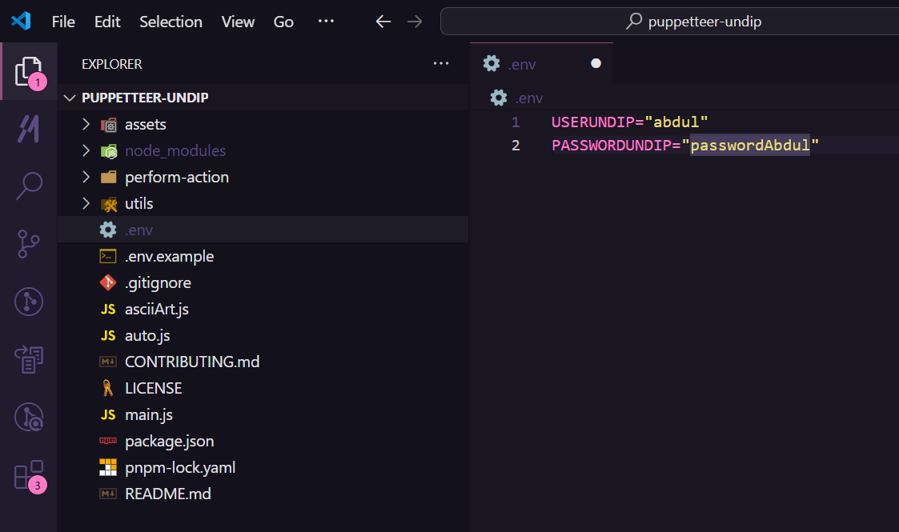

```
USERUNDIP="username"
PASSWORDUNDIP="password"
```

lalu run file utama

```
node .
```

thats it!

## 📖 Project Wiki

### How to update :

```
git pull
```

```
pnpm install
```

### bob : robot

contoh : ->

```
bob kamu siapa
```

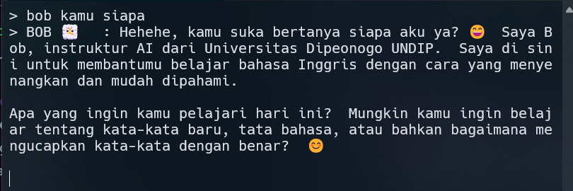

### a : All Auto Answer in one unit

go to unit you want to answer

```
a
```

### 1 : Soal Pilihan Ganda

contoh soal ->

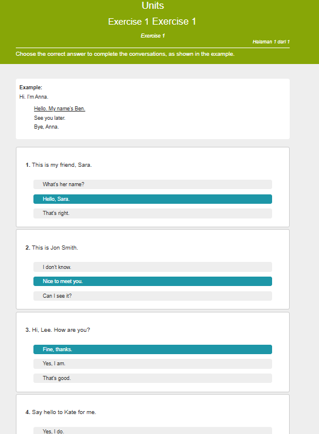

### 2 : Soal Isian TextArea

contoh soal ->

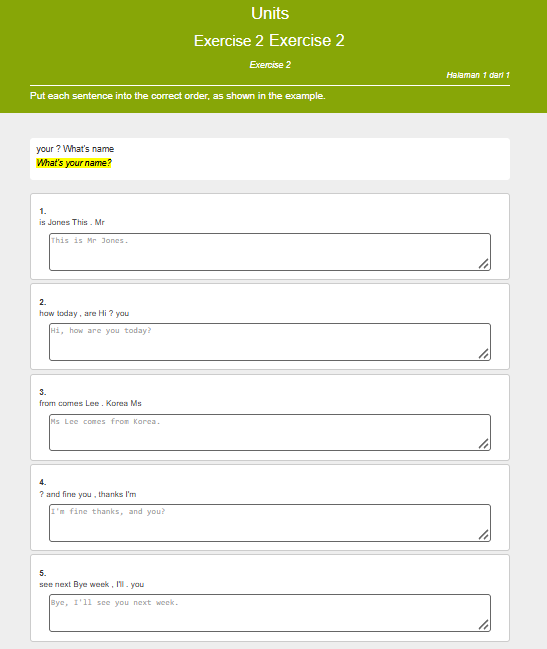

### 3 : Soal Ceklis Ceklis

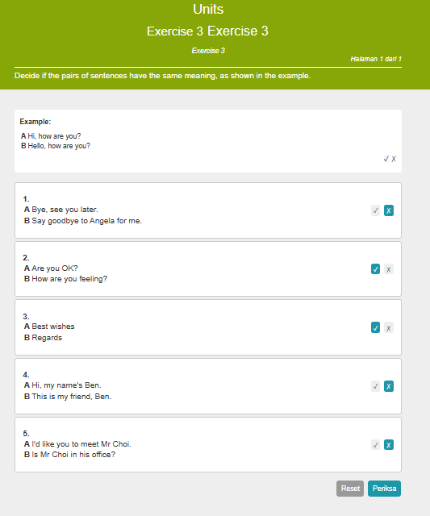

### 4 : Soal Dropdown

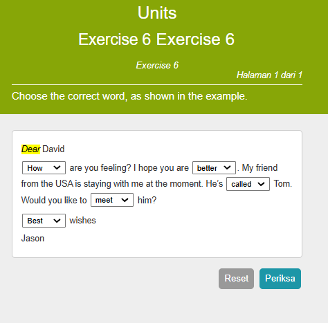

### 5 : Soal Select Word Kata

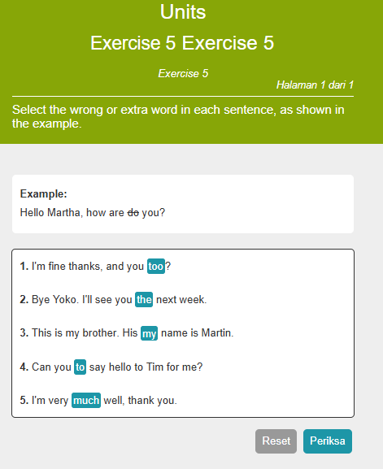

### 6 : Soal Isian TextBox (Complete the sentences)

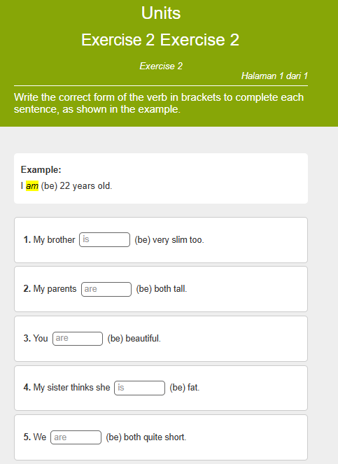

### 7 : 7 : Soal Fill the gap (Choose the words that cannot fill the gaps)

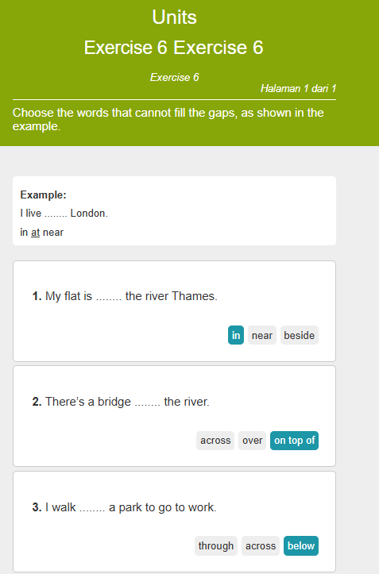

## Contributing

All contributions are welcome. Please take a look at [contributing](./CONTRIBUTING.md) guide.

## License

This project is licensed under the GNU GENERAL PUBLIC LICENSE
Version 3 License - see the [LICENSE](./LICENSE) file for details
