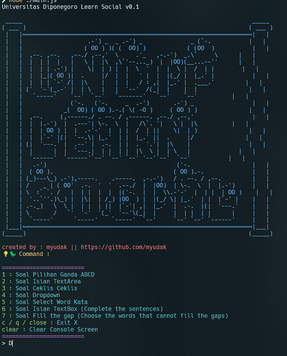

This isn’t exactly a ‘hack’ in the traditional sense—it's more like an incredibly efficient automation technique for responding to a wide range of question types on the LearnSocial platform. Using Puppeteer, this method automates the process of answering questions, handling everything from multiple-choice to short-answer formats. It’s designed to provide rapid, consistent responses, saving time and reducing effort while maintaining accuracy across various types of queries. Perfect for those looking to streamline their interactions with the platform, this solution leverages the power of Puppeteer’s scripting capabilities to automatically fetch, analyze, and respond to questions, making it a valuable tool for anyone aiming to navigate LearnSocial efficiently and effectively."ns.

## Get started

### Prerequisites

- [git](https://git-scm.com)
- [pnpm](https://pnpm.io/installation)
- [node.js](https://nodejs.org/en/download/package-manager)

### 1. Clone the repository

```
git clone https://github.com/myudak/learnSocial-hack.git
```

### 2. Install dependencies

```
pnpm install
```

### 3. Run the project

```
node main.js
```
